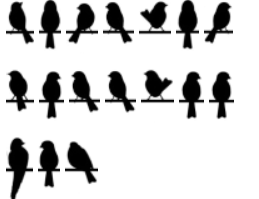

# Chirp Chirp

You just got out of your 11:30am class and your 1pm class was just canceled. With no class until 4pm you decide to eat lunch by the library pond. A charm of sparrows land on the railing, you think they are trying to tell you something.

What are the birds trying to tell you?

(capitalize and separate you words with underscores when submitting your flag)

---

Type your answer below and submit to see if you're correct:

  <form id="answer-form">
    <input type="text" id="user-answer" placeholder="Enter your flag..." required>
    <button type="submit">Submit</button>
  </form>
  

